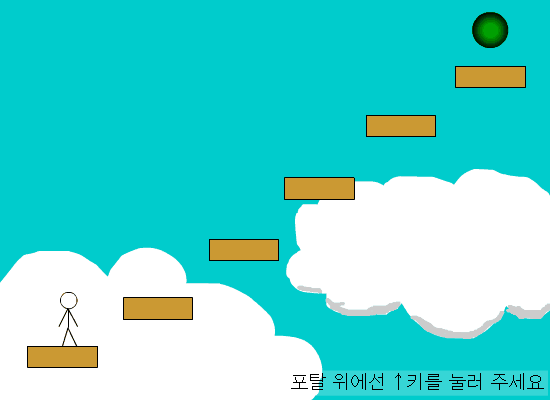

# man-game-as3

  
y=f(x)님의 플랫포머 원작을 ActionScript 3.0에 가능한 객체지향적으로 이식한 버전입니다.

원저작권은 y=f(x)님에게 있습니다.  
[원작자 블로그](https://blog.naver.com/wnsdh0806)

### y=f(x)는 누구인가?
오래전, 플래시 365에서 플래시를 창작하던 아마추어 사이에서
점프점프라는 장르로 수많은 컨텐츠 제작 아마추어 분들에게
보다 플랫포머를 쉽게 접근하고 만들어볼 수 있게 해주셨던 분입니다.  
[해당 글 주소](http://flash365.dreamx.com/game/view.php?id=flash_study&page=6&sn1=&divpage=1&sn=on&ss=off&sc=off&keyword=y=f(x)&select_arrange=headnum&desc=asc&no=11439)  
[아카이브](https://web.archive.org/web/20190225153835/http://flash365.dreamx.com/game/view.php?id=flash_study&page=6&sn1=&divpage=1&sn=on&ss=off&sc=off&keyword=y=f(x)&select_arrange=headnum&desc=asc&no=11439)

제가 플랫포머를 좋아하게 된 이유는 마리오였지만,
제가 플랫포머 게임을 만드는 걸 좋아하게 된 이유는 이분의 영향이 굉장히 컸습니다.

지금까지도 존경하시는 분입니다.  
최근들어 소식을 듣진 못한다는 게 아쉽기만 할 뿐이네요.

### 왜 AS3로 이식했는가?
위에서 올린 글에서 볼 수 있듯이, 원본 소스를 좋은 취지로 배포하셨지만, 
당시에는 불특정 다수가 자신의 이익과 만족만을 채우기 위해
본인이 만들었다는 등의 갈등이 있었습니다.

그래서 더 이상 원본 소스를 구할 수 없게 됐죠.

최근에 저의 하드를 둘러보면서 우연히 이 원본 소스를 발견했습니다.  
이걸 이식하고 공개하자 생각하게 된 이유는 [여기에 있'었'습니다](https://namu.wiki/w/2019년%20인디%20게임%20규제%20논란).

그 당시에 저는 잊혀지기 전에 아카이브 의식과 같은 목적으로
플래시 창작 커뮤니티에 큰 기여를 해주신 y=f(x)님의 원본을
객체지향적으로 코드를 재구성했습니다.

### 비영리 게임 등급분류 '면제', 8월 시행 예정
2019년 8월부터 정부 시행안으로 인해 이제 비영리 목적을 가진 게임은 등급분류를 면제받게 됐습니다!🎉  
한국에 계시는 모든 창작 꿈나무 여러분들을 응원합니다!  

## 알려진 문제점

- 지형 두개를 겹쳐서 점프를 누르고 있으면 높은 점프를 할 수 있습니다.
- OOP의 제한적인 구현으로 지름길의 작아진 물리를 수식으로 구현하는 것으로 인해 땅에서 통통 튀는 버그가 있습니다.
